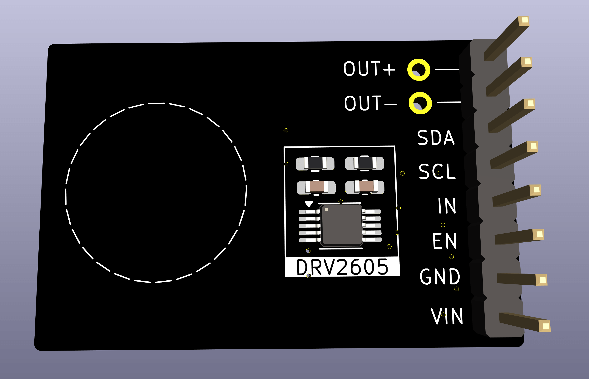
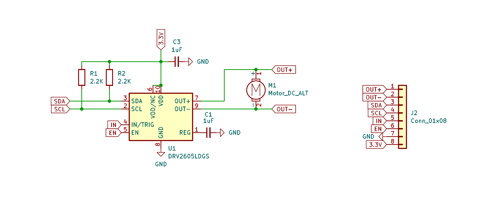

# DRV2605 Breakout Board

> [!WARNING]
> The information and material (code, designs, files, ...) are provided "AS IS". We make no representation or warranty of any kind, express or implied, regarding the accuracy, adequacy, validity, reliability, availability, or completeness of any information or material. Use this at your own risk.

> [!WARNING]
> At the time of writing this PCB has not even been produced yet, and as such, it has not even been tested yet! Once it has been properly tested, I will confirm that everything works as expected.

## Introduction

This is a breakout board for the TI DRV2605 Haptic Motor Driver. 

[https://www.ti.com/product/DRV2605L](https://www.ti.com/product/DRV2605L)

## Change Log

* v1.0
  * Initial design 

## Design Considerations

* This board is for the DRV2605L variant, VSSOP package

## Schematics 

## How to Obtain the Physical PCB

The Gerber file is in this repository (`gerbers/DRV2605-breakout.zip`). Simply upload this file a PCB manufacturer of your choice (JLPCB, PCBWay, ...), and you they will make it for you for as low as \$5 for 5 pieces (with the cheapest shipping option, which can take a few weeks).

For JLCPCB, select the order number option where they will replace "JLCJLCJLCJLC" on the board with the actual order number.

> [!WARNING]
> Note that will still have to solder the components onto the PCB yourself!

## How to Edit Design

Everything you need to edit this design in KiCad 8 is included in the repository.

## Sources

* [https://www.ti.com/product/DRV2605L](https://www.ti.com/product/DRV2605L)
* [https://www.adafruit.com/product/2305](https://www.adafruit.com/product/2305)
* [https://www.sparkfun.com/products/14538](https://www.sparkfun.com/products/14538)
